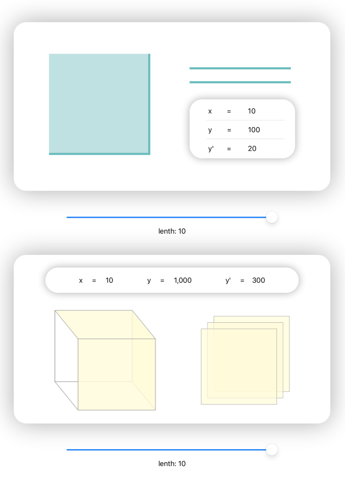
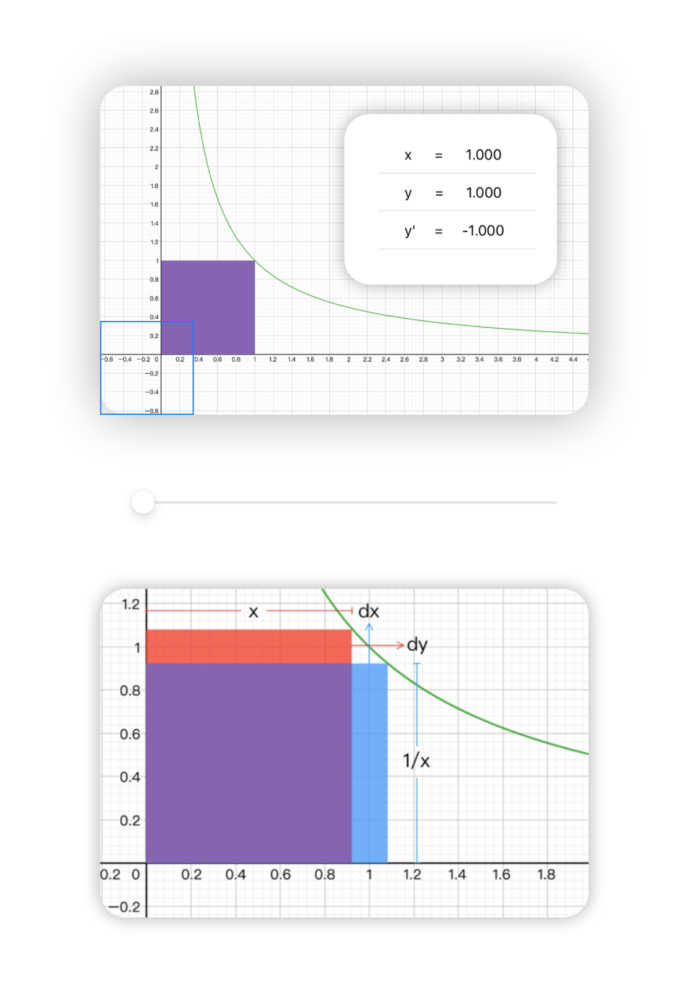
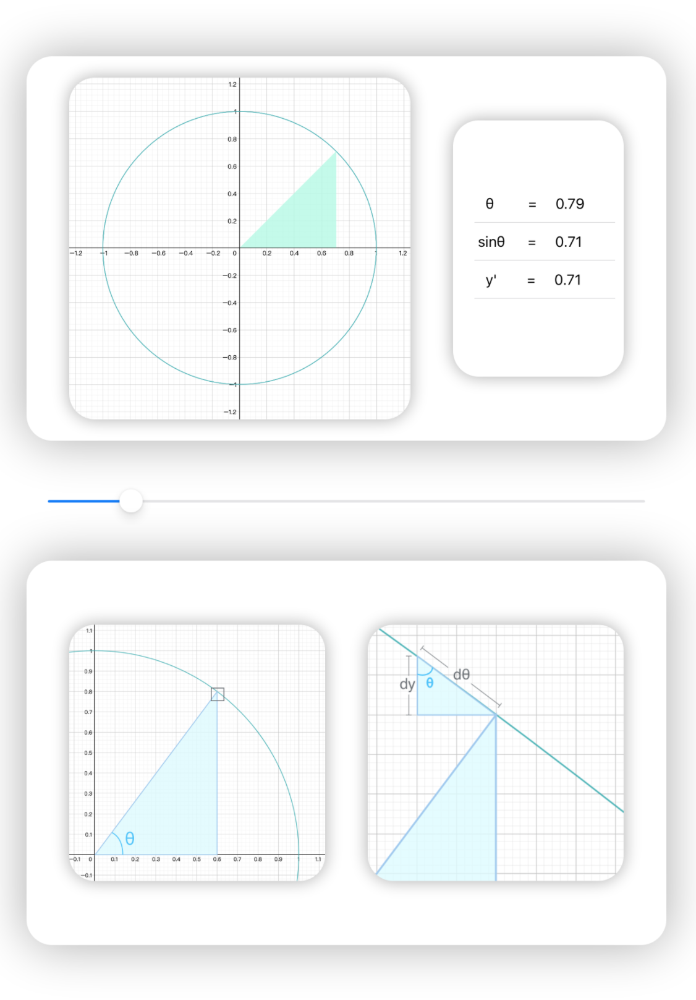
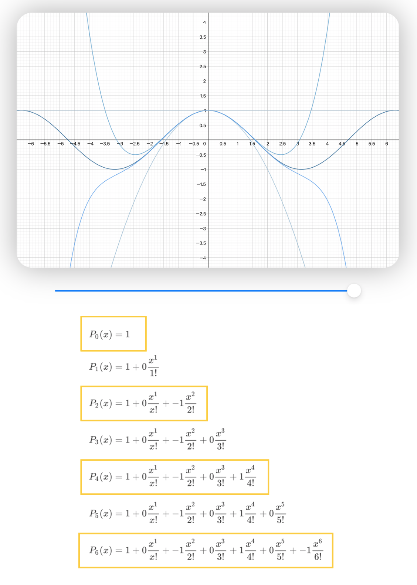

# Introduction

I made a playground to make the process of learning part of calculus knowledge easier and have more fun. I used simple and efficient SwiftUI to visualize the mathematical principles. With a declarative Swift syntax that's natural to write, SwiftUI keeps my code easy to read. Automatic support for Dynamic Type makes it easier for me to change the view based on user input. Some functions that SwiftUI does not have can also be realized by interfacing with UIKit.

# From the car to the Taylor series

## page 1

Let's start with the car. As we all know, if you want to predict the position of a car, you need to know its speed. Then, if you know the derivative of a function, you can figure out how an equation is changing at any moment. The velocity is equal to the change in your position divided by the change in time, so we’d call velocity the derivative of position. You can write the derivative as f’(x) or y’.

When you need to request the velocity of a car：

> V = ds / dt

When you need to request the derivative of a function：

> y’ = dy / dx

The "dt" is an infinitely tiny interval of time, and the "ds"  is an infinitely tiny interval of position. Why do they need to be so tiny? Because the closer the time is to the present, the more accurate our prediction is. For example, you can know what you are doing next second, but you don’t know what you are doing next month.

## page 2

We know how the position changes over time, but how the area of a square changes with the length of a side？First we need to know the formula of the area：

> y = x^2^

Then please see the picture on the right and move the slider. You can see that the area of the square is changing, and the area that is about to increase looks like two line segments. The length of these two line segments is exactly equal to the side length, so we can get the derivative of the area:

> y' = 2x

The volume equation of the cube is as follows, can you use the same method to find the volume derivative of the cube？

> y = x^3^

The answer is:

> y’ = 3x^2^

## page 3

We will increase the difficulty, let us consider the following inverse proportional function:

> y = 1 / x

Firstly, let’s deform the function:

> 1 = xy

We find that no matter how x and y changes, their product is 1. In the picture, the purple part is the overlapping part, so the area of the blue rectangle will be equal to the area of the red rectangle:

> dx · 1/x = x · dy
>
> y’ = dx / dy = 1 / x^2^

One more thing, can you find the pattern from the following formula？

> y = x^2^  =>  y’ = 2x^1^
>
> y = x^3^  =>  y’ = 3x^2^
>
> y = x^-1^ =>  y’ = -1x^-2^

The law is:

> y = x^a^  =>  y’ = ax^a-1^

## page 4

The sine function is very beautiful, and its derivative is very simple.

> y = sinθ

We found that the two line segments represented by "dθ" and "dy" can form a small triangle. Obviously, the three angles of the small triangle are equal to the three angles of the original triangle, so they are similar triangles. Then:

> y’ = dy / dθ = adj / hyp = cosθ

In the same way, we can derive:

> y = cosθ
>
> y’ = -sinθ

## page 5

Finally, let's get back to the car. How do we imitate a car? We can make them the same color, size, and weight, we can also make their position, speed, acceleration the same. Then, how do we imitate a function? Taylor's answer is to make their derivatives the same, their second derivatives the same, their third derivatives the same, and so on.

Let's take the cosine function as an example. We make P0 has the same value at the origin as the cosx. We make P1 has the same value and the same derivative value at the origin as the cosx. We make P2 have the same value, the same derivative value, and the same second derivative value at the origin as the cosx…

In the end, we will get a function infinitely close to the cosine function. This is the Taylor series.

---

The last thing I want to say is that maybe mathematics is very abstract and difficult. But when you feel math is boring, the only reason is that you have not tried to appreciate its charm. No matter how huge the world is, it is also built on simple laws. When you study math, what you learn is not the most important thing. The most important thing is what is happening in your mind during the learning process.